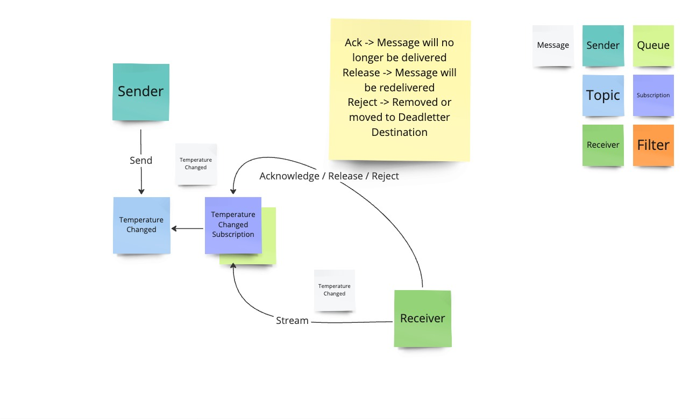
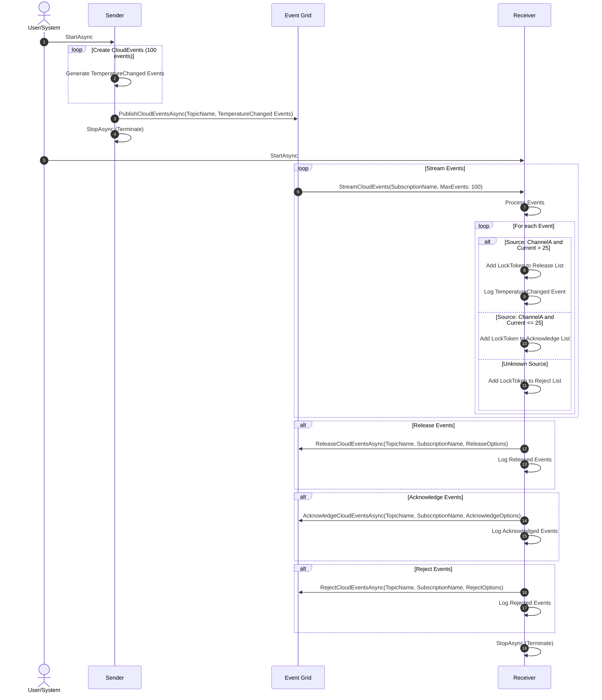
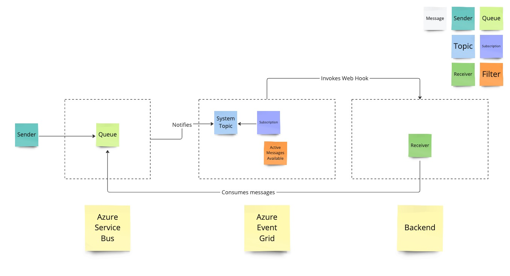
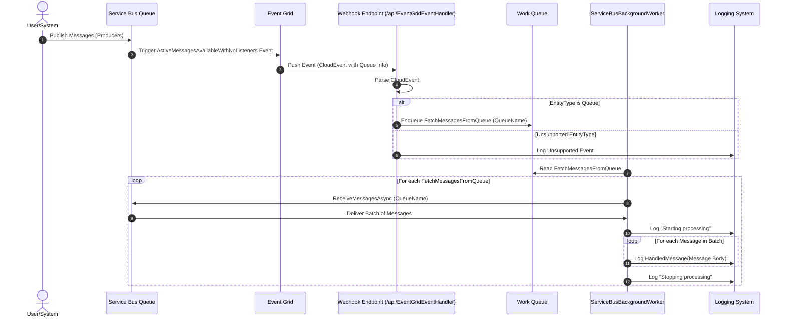

# Event Grid

## Exercises

### Pull Delivery (Simple)

#### Overview



#### Sequence



#### Instructions

Address all `// TODO` in the code.

Bonus exercise:

Could you implement a simple task queue with Event Grid Pull that operates similar to Azure Storage Queues? Think about the design implications, challenges etc. and discuss it with one of your peers.


### Push Delivery (Simple)

#### Overview



#### Sequence



#### Instructions

Address all `// TODO` in the code.

Bonus exercise:

Change the Azure Service Bus processor to have a failure rate that moves a certain percentage of messages into the deadletter queue. Hook up a new event grid subscription that notifies when a message is moved to the deadletter queue and move it back to the input queue it came from.

- [DeadLetterMessageAsync](https://learn.microsoft.com/en-us/dotnet/api/azure.messaging.servicebus.servicebusreceiver.deadlettermessageasync)

## Solutions

### Pull Delivery

#### Prerequisites

1. A fully deployed Event Grid namespace (use `eventgrid-pull.bicep` to deploy it) (adjust the necessary parameters or [create a parameter file](https://learn.microsoft.com/en-us/azure/azure-resource-manager/bicep/parameter-files))
1. Add the access key and the endpoint URL from the output to `appsettings.json` in the `EventGridOptions` section

#### Running it

`dotnet run -c Release`

### Push Delivery

The sample/solution shows how to leverage Event Grid notifications delivered over a web hook to automatically spin up Azure Service Bus receivers. Normally you would probably use Azure Functions to do serverles processing up Service Bus queues but this sample here was designed to demonstrate the power of Event Grid by making it possible to combine multiple Azure resources together.

#### Prerequisites

1. A fully deployed Azure Service Bus Premium namespace (use `eventgrid-push-servicebus.bicep` to deploy it) (adjust the necessary parameters or [create a parameter file](https://learn.microsoft.com/en-us/azure/azure-resource-manager/bicep/parameter-files))
1. Add the connection string from the output to `appsettings.json` in the `ServiceBus` section

##### Ngrok

1. A [ngrok account](https://ngrok.com) with a free domain
1. [Installed ngrok CLI](https://ngrok.com/docs/getting-started/#step-2-install-the-ngrok-agent) on the computer
1. Log into ngrok in the CLI

##### Dev Tunnels

Alternatively it is possible to use Dev-Tunnles

1. [Install the devtunnels CLI](https://learn.microsoft.com/en-us/azure/developer/dev-tunnels/get-started?#install)
1. [Login](https://learn.microsoft.com/en-us/azure/developer/dev-tunnels/get-started#login)

#### Running it

1. Make sure the endpoint is running before deploying! `dotnet run -c Release`

##### NGrok

1. Setup ngrok "tunneling" with `ngrok http --domain=customdomain.ngrok-free.app 8080 --host-header=rewrite` (assuming the solution runs on port 8080 locally, replace `customdomain` with your custom domain)
1. Modify  `eventgrid-push.bicep`
  1. Replace the `endpointUrl` value with the custom domain URI
  1. Remove `deliveryAttributeMappings` in the `EventGridSubscription` since it is not necessary 

##### Dev Tunnels

1. Setup devtunnel with `devtunnel host -p 8080 --allow-anonymous` with anonymous access _or_
1. Setup devtunnel with `devtunnel host -p 8080` and note down the tunnel id
1. Create an access token `devtunnel token <tunnelI-d> --scope connect`
1. Modify  `eventgrid-push.bicep`
  1. Replace `endpointUrl` value with the dev tunnel URI
  1. Add your token to the `X-Tunnel-Authorization` value `<token>`

##### Deploy

1. Use `eventgrid-push.bicep` to deploy (adjust the necessary parameters or [create a parameter file](https://learn.microsoft.com/en-us/azure/azure-resource-manager/bicep/parameter-files)). Make sure to at least replace the `endpointUrl` to your ngrok or dev tunnel.
1. Send messages into the configured queue either by writing some code or use [ServiceBus Explorer](https://github.com/paolosalvatori/ServiceBusExplorer) to send messages.

#### Reading material

- [Azure Service Bus to Event Grid integration overview](https://learn.microsoft.com/en-us/azure/service-bus-messaging/service-bus-to-event-grid-integration-concept?tabs=event-grid-event-schema)
- [Azure Service Bus as an Event Grid source](https://learn.microsoft.com/en-us/azure/event-grid/event-schema-service-bus)
- [Tutorial: Respond to Azure Service Bus events received via Azure Event Grid by using Azure Logic Apps](https://learn.microsoft.com/en-us/azure/service-bus-messaging/service-bus-to-event-grid-integration-example)

## Troubleshooting

In case off

```text
{
    "status": "Failed",
    "error": {
        "code": "InternalServerError",
        "message": "Unable to verify access to resource /subscriptions/SUBSCRIPTION_ID/resourceGroups/RESOURCEGROUP/providers/Microsoft.Storage/storageAccounts/YOURSTORAGEACCCOUNT. Please try again in a few minutes."
    }
}
```

the deployment principle probably requires `EventGrid Contributor` role.

```bash
PRINCIPAL_ID=$(az ad signed-in-user show --query id -o tsv)
```

```bash
# Assign EventGrid Contributor role at resource group level
az role assignment create \
  --assignee $PRINCIPAL_ID \
  --role "EventGrid Contributor" \
  --resource-group <your-resource-group-name>
```