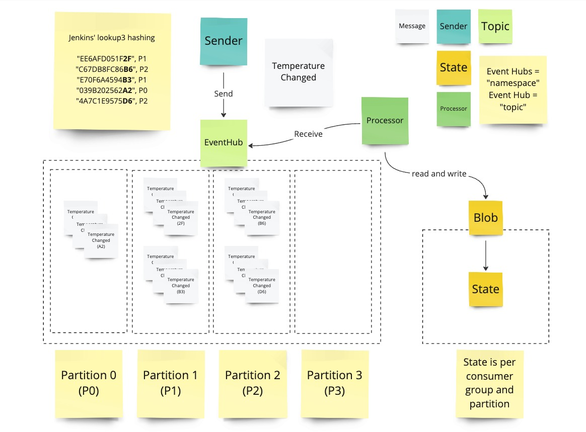
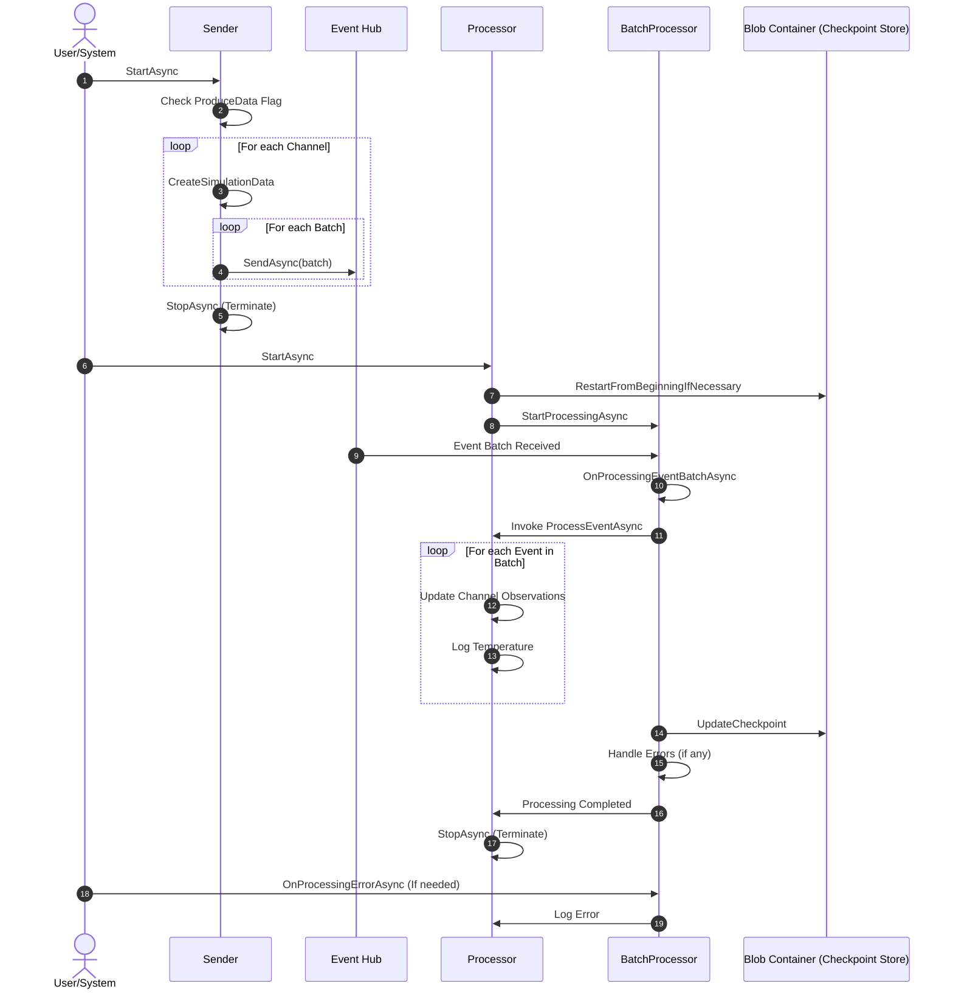

# Event Hubs

## Exercises

### Processor (Simple)

#### Overview

#### Sequence

#### Instructions

Address all `// TODO` in the code.

Bonus exercise:

- Play around with the channels
- What are the implications of using the channel as a partition key? What would happen if you don't use the channel as a partition key? Are there better ways to partition the data? Discuss your findings it with one of your peers.
- Set `ProduceData` to `false` in the `SenderOptions`, process all data. Restart and see what happens. The set the `RestartFromBeginning` to `true`. Do the same spiel again but this time change the threshold. Discuss your findings it with one of your peers.

## Solutions

### Processor

#### Prerequisites

1. A fully deployed Event Hub with an Azure Storage Account (use `eventhubs.bicep` to deploy it) (adjust the necessary parameters or [create a parameter file](https://learn.microsoft.com/en-us/azure/azure-resource-manager/bicep/parameter-files))
1. Add the event hub connection string and event hub name output to `appsettings.json` in the `EventHubs` section
1. Add the blob storage connection string output to `appsettings.json` in the `StorageOptions` section. Make sure to set a unique container name

#### Running it

`dotnet run -c Release`

## ProcessorSchemaDemo

1. dotnet tool install --global Apache.Avro.Tools --version 1.11.3
1. avrogen -s TemperatureChanged.avsc .
1. Register the schema in the schema registry
1. Send a bit of data and then change the schema version and run again
1. Delete the first version to make it incompatible and run again to show how the sender fails (mention validation callbacks in later versions that are still preview)
1. Introduce a new version that is compatible again.  

### RBAC

Attention: The permissions here are generous for demo purposes only

1. Create a new Entra ID application `EventHubsRBAC`
1. Assign the API permission `Microsoft.EventHubs` and `Azure Storage`
1. Create a Client secret `EventHubsClientSecret` under Certificates & Secrets
1. Under the event hubs namespace under Access control (IAM)
  1. Add a role assignment with `Azure Event Hubs Data Owner` and add `EventHubsRBAC` under members 
  1. Add a role assignment with `Schema Registry Contributor (Preview)` and add `EventHubsRBAC` under members
1. Under the storage account under Access control (IAM)
  1. Add a role assignment with `Storage Blob Data Contributor` and add `EventHubsRBAC` under members
1. Add the event schema to the registry with `ProcessorSchemaDemo.TemperatureChanged`
1. Configure launchSettings.json accordingly

#### Schema registry

1. Change the event schema to a new version
1. Start the application
1. Change it to something incompatible and delete the compatible version
1. Start again

#### Application Groups

1. Add an application group and allow one message per second incoming
2. Change application group to allow more messages per second  