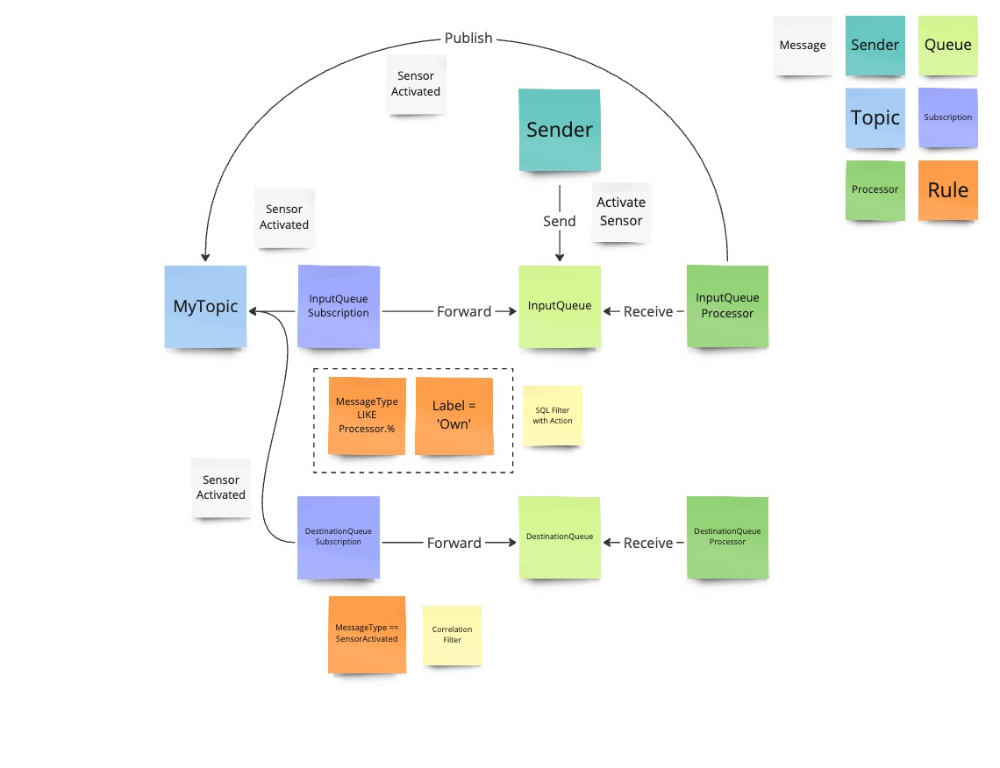
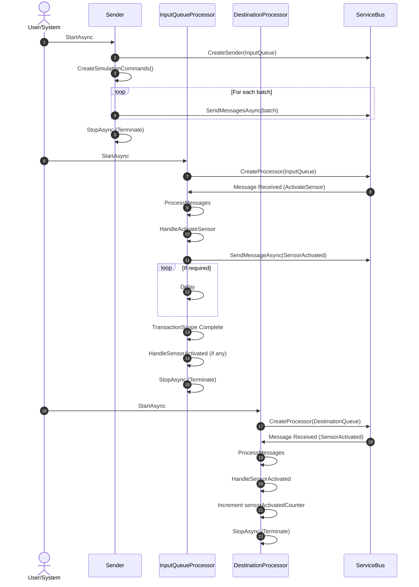
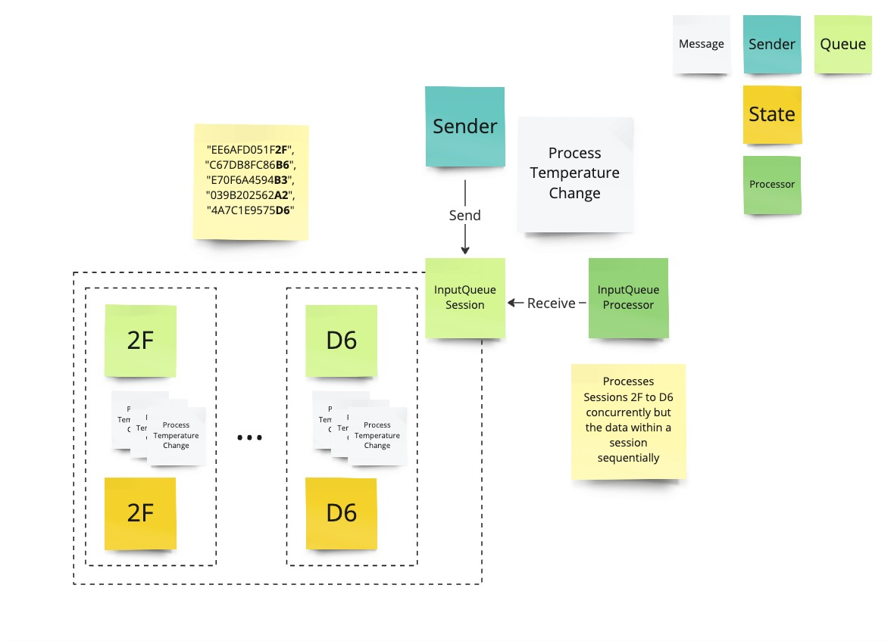

# Service Bus

## Exercises

### Processor (Simple)

#### Overview

#### Sequence

#### Instructions

Address all `// TODO` in the code.

Bonus exercise:
- Disable the forwarding on one of the subscriptions and try to introduce a new processor that receives from the subscription.
- How is it possible to deadletter messages and modify the original message with let's say the exception stack trace?
- Let's assume you'd have to throttle concurrency across all subscriptions on a processor that has multiple subscription receivers. How would you achieve that? Discuss with one of your peers the benefits and drawback of forwarding to the input queue from the subscription
- Is it possible to send messages into the future? If so what could you achieve with that?

### SessionProcessor (Simple)

Address all `// TODO` in the code.

Bonus exercise:
- Play around with the channels
- What are the implications of using the channel as a session id? What would happen if you don't use the channel as a session id? Are there better ways to seggregate the data? Discuss your findings it with one of your peers
- What are the drawbacks of using session state as a durable store?
- How could you combine messages sent into the future with sessions? Is it even possible?

## Solutions

### Processor

#### Prerequisites

1. A fully deployed Service Bus namespace (use `servicebus.bicep` to deploy it) (adjust the necessary parameters or [create a parameter file](https://learn.microsoft.com/en-us/azure/azure-resource-manager/bicep/parameter-files))
1. Add the service bus connection string and service bus connection string without managed rights output to `appsettings.json` in the `ServiceBusOptions` section

#### Running it

`dotnet run -c Release`

### SessionProcessor

#### Prerequisites

1. A fully deployed Service Bus namespace (use `servicebus.bicep` to deploy it) (adjust the necessary parameters or [create a parameter file](https://learn.microsoft.com/en-us/azure/azure-resource-manager/bicep/parameter-files))
1. Add the service bus connection string and service bus connection string without managed rights output to `appsettings.json` in the `ServiceBusOptions` section

#### Running it

`dotnet run -c Release`

## Demo

### RBAC

1. Create a new Entra ID application `ServiceBusRBAC`
1. Assign the API permission `Microsoft.ServiceBus` and give it full access to the Azure Service Bus service
1. Create a Client secret `ServiceBusClientSecret` under Certificates & Secrets
1. Create a queue with name `rbacqueue`
1. Add a role assignment with `Azure Service Bus Data Sender` and add `ServiceBusRBAC` under members directly on the queue `rbacqueue` under Access control (IAM)