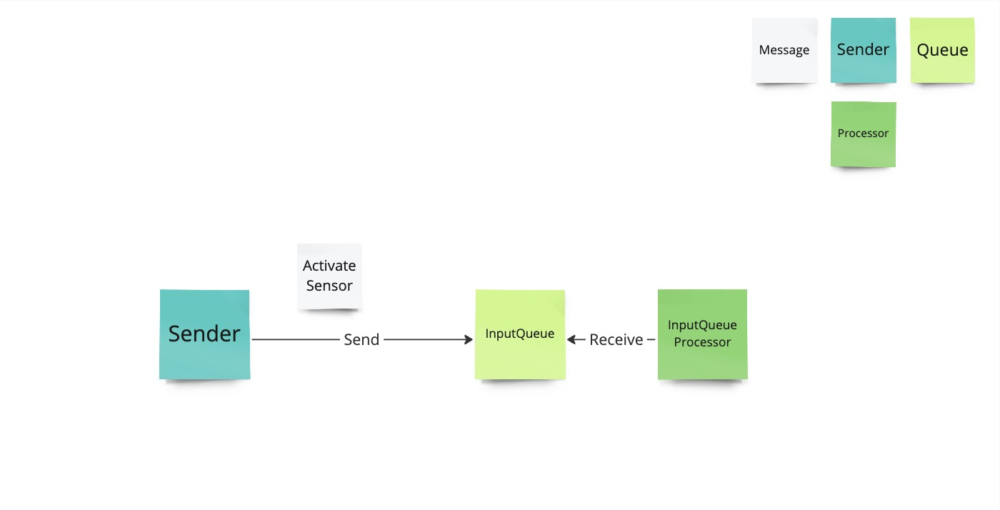
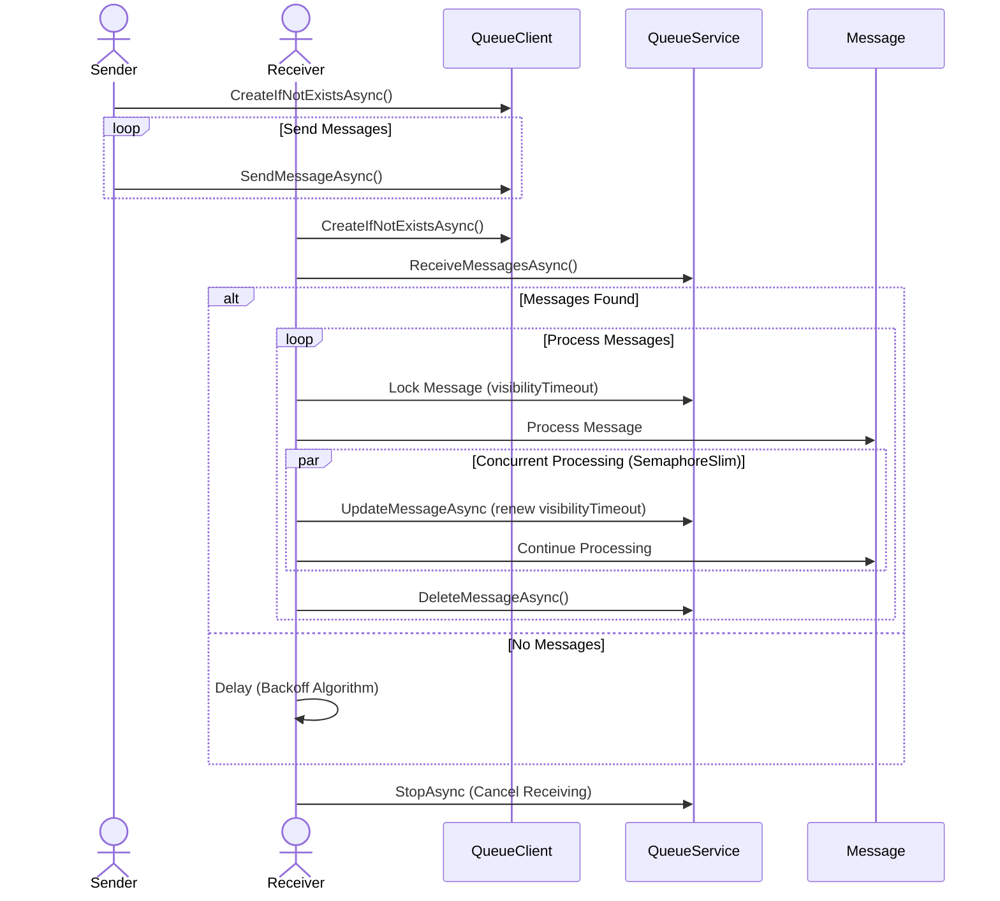

# Storage Queues

## Exercises

### Send and Receive

#### Overview

#### Sequence

#### Instructions

Address all `// TODO` in the code.

Bonus exercise:
- What happens if you don't renew the lease or if the lease is renewed too late? Play around with the lease renewal settings a bit
- How is it possible to deadletter messages and modify the original message with let's say the exception stack trace?
- Is it possible to send messages into the future? If so what could you achieve with that?
- Given the rather tight restrictions about the payload size how would you implement offloading the body to for example a blob storage?
- Given the message visibility timeout what are the consequences of potential unclean restarts of a receiver?
- In order to improve the receive speed when the queues are full can you imagine a better way of receiving messages that has an optimal balance between polling, not incurring too much costs during idle time and increasing the throughput on busy queues?
- You need to store a small set of metadata that is unique per queue. How would you achieve that? What are the limitations?
- Is it possible to retrieve runtime information like the message count with StorageQueues? How would you achieve that?

## Solutions

### Send and Receive

#### Prerequisites

1. A fully deployed Event Hub with an Azure Storage Account (use `storage.bicep` to deploy it) (adjust the necessary parameters or [create a parameter file](https://learn.microsoft.com/en-us/azure/azure-resource-manager/bicep/parameter-files))
1. Add the storageconnection string output to `appsettings.json` in the `Storage` section
1. Make sure set the `QueueName` too (has to follow the [naming conventions](https://learn.microsoft.com/en-us/rest/api/storageservices/naming-queues-and-metadata))

#### Running it

`dotnet run -c Release`